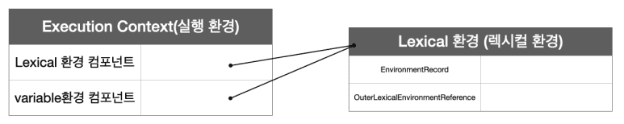
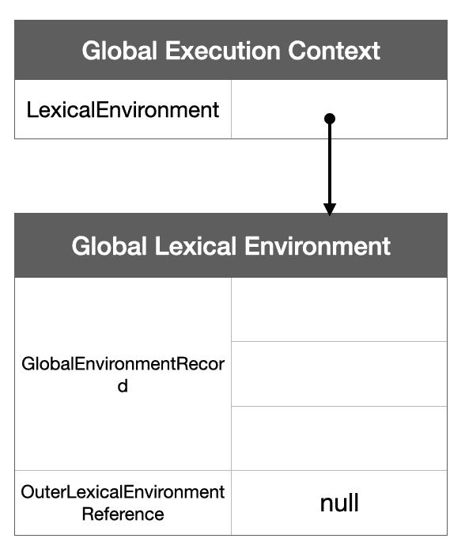
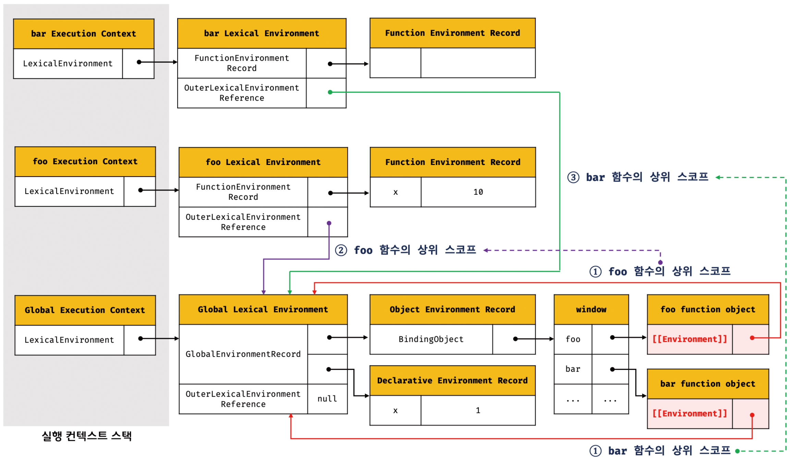
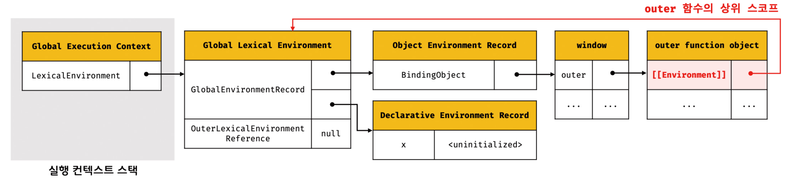
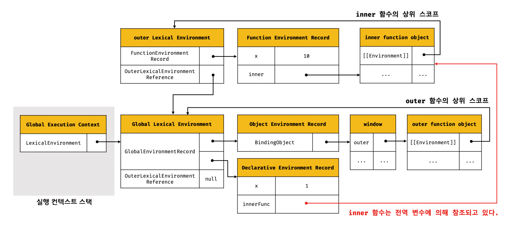

#### 🔖 Closure는함수형 프로그래밍 언어에 등장한다.

MDN의 Closure 정의

> “A closure is the combination of a function and the lexical environment within which that function was declared.”

> 클로저는 함수와 그 함수가 선언된 렉시컬 환경과의 조합이다.

### Lexical Scope

```jsx
const x = 1
function outerFunc() {
  const x = 10

  function innerFunc() {
    console.log(x) // ✅ 10
  }
}
```

javasciprt의 스코프 개념을 먼저 알아야 하는데<br/>
해당 개념은 https://yeaseul7.github.io/neekoblog/hoisting/ 을 다루는 글을 통해 보면 된다.

`outerFunc` 안에 중첩 함수인 `innerFunc`가 정의 되었다.<br/>
이때 `innerFunc` 의 상위 스코프는 `outerFunc` 이다.<br/>
따라서 내부함수인 `innerFunc` 은 외부함수인 `outerFunc` 의 x 에 접근할 수 있다.

하지만 아래와 같이 `outerFunc`와 `innerFunc`가 선언되었다면 접근 불가능 하다.

이러한 개념이 스코프 개념이라고 간단하게 설명할 수 있다.

```jsx
const x = 1

function outerFunc() {
  const x = 10
}

function innerFunc() {
  console.log(x) // ✅ 1
}
```

따라서 javascript가 렉시컬 스코프를 따르는 프로그래밍 언어이다.

> **자바스크립트 엔진은 함수를 어디서 호출했는지가 아니라 함수를 어디에 정의했는지에 따라 상위 스코프를 결정한다. 이를 렉시컬 스코프(정적 스코프)라 한다.**

#### 스코프의 실체는 무엇인가?

실행 컨텍스트의 렉시컬 환경이다.

관련 포스팅(https://yeaseul7.github.io/neekoblog/hoisting/) 을 먼저 읽어오기를 바란다.



여기서 스코프는 렉시컬 환경이다.

#### 그러면 렉시컬 스코프란 무엇인가?



여기서 Outer LexicalEnvironment Reference에는 상위 스코프에 대한 참조가 들어간다.<br/>
이것은 함수 정의가 **평가되는 시점에** 해당 함수의 환경에 의해 결정되는데, 이게 바로 렉시컬 스코프다.

⚠️ 함수는 정의 된 곳과 호출되는 위치가 다를 수 있다.<br/>
따라서 렉시컬 스코프가 결정되려면 자신이 호출되는 위치와 상관없이 정의된 환경의 스코프를 기억해야한다.<br/>
이걸 함수의 내부 슬롯인 [[Environment]]에 저장한다.

```jsx
const x = 1

function foo() {
  const x = 10
}

bar()

function bar() {
  console.log(x)
}

console.log(x)

foo()
bar()
```

위의 코드를 통해 렉시컬 스코프에 대해 그림으로 이해해보자.



## Closure

외부함수보다 중첩함수가 더 오래 유지되는 경우 (생명주기가 종료된 외부함수의 변수를 중첩함수 내부에서 참조하는 현상)

```jsx
const x = 1

function outer() {
  const x = 10
  const inner = function () {
    console.log(x)
  }
  return inner
}

const innerFunc = outer()

innerFunc() //✅ 10
```

outer가 inner를 반환한 시점에서 outer의 LifeCycle은 끝이 났다.<br/>
하지만 innerFunc은 outer안에 있는 지역변수 x의 값을 찍고 있다.

inner함수가 평가될 때 inner 함수의 [[Environment]]에는 상위 스코프에 대한 정보가 있을 것이다.<br/>
그러면 outer 함수는 평가될 때 전역 스코프를 함수의 [[Environment]]에 저장하고 있을 것이다.



outer 함수가 return 하면 outer의 실행 컨텍스트는 제거되고 생명주기 또한 끝나지만<br/>
outer의 렉시컬 환경은 내부 슬롯에 저장되어있다.

inner 함수가 외부 렉시컬 환경을 outer 함수로 참조하고 있기 때문에 GC가 함부로 가져가지 않는다.<br/>
이러한 현상을 클로저라고 한다.



inner 함수를 반환 받은 innerFunc에 의해 inner 함수가 더 오래 생존하게 된 것이다.<br/>
즉 inner 함수의 외부 렉시컬 환경에 outer의 x가 들어있기 때문에 innerFunc에서 10이 나오는 것이다.

상위 스코프의 어떤 식별자도 참조하지 않는 경우 대부분의 모던 브라우저는 최적화를 통해 상위 스코프를 기억하지 않는다. 따라서 Closure라고 말할 수 없다.
