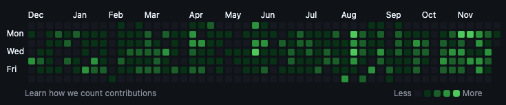

### 2025 회고록

취업을 하고 어느덧 2년 차가 된 해였다.
2023년 12월부터 근무를 시작해서 정규직으로 이직한 지 1년 반이 지났다.
하지만 올해는 눈에 띄는 성과나 이렇다 할 활동이 부족했던 것 같다.
이대로 3년 차, 4년 차가 된다면 미래의 나 자신에게 실망할 것 같아, 2025년을 되돌아보고 더 발전하고자 회고록을 작성한다.

### 개발자가 된 이유를 되짚어보며..

내가 개발의 길을 택한 것은 2022년 즈음이다.
개발 툴이 무엇인지조차 몰랐던 경영학과 출신의 내가 개발을 택한 이유는, 투입(Input)과 산출(Output)이 명확하다는 점 때문이었다. 무엇보다 컴퓨터 공학에 진심으로 몰입해 있는 선배들의 모습이 부러웠다. 나도 그들처럼 무언가에 깊게 빠져있는 사람이 되고 싶었다.

노력한 만큼 결과가 나오고, 과정이 객관적이라는 점이 매력적이었다.
단순히 '공부하는 척'이 아니라, 컴퓨터 공학에 진심 어린 호기심을 가져야만 내가 동경하던 선배들처럼 성장할 수 있을 것이라 생각했고, 그 방법을 끊임없이 탐구했다.

그렇게 본래 전공이었던 경영학을 부전공으로 전환하고, 소프트웨어공학을 주전공으로 선택했다. 그만큼 뛰어난 개발자가 되고 싶었다.
그 마음은 지금도 변하지 않았다.
공부를 거듭할수록 욕심이 생겼고, 더 큰 조직에서 뛰어난 동료들과 함께 일하고 싶은 열망은 여전히 유효하다.

### 1월~6월: 캡스톤 프로젝트와 시행착오

이 기술 블로그를 개설하고 꾸준히 운영하고자 마음먹었으나, 회사에서 L사(또는 대기업)와의 프로젝트로 인해 업무 강도가 높아졌다.
그 사이 미처 이수하지 못했던 마지막 수업인 '캡스톤 디자인'을 수강하며 졸업 프로젝트를 진행했다.
'썸원'과 유사한 컨셉으로, 반려견에게 매일 편지를 쓰고 기록할 수 있는 서비스였다.

매일 아침 사용자에게 오늘의 질문을 제시하고 일기장을 쓸 수 있도록 기획했다.
이 과정에서 생성형 AI를 도입해 보고 싶었다.
팀원들과 LangChain이 무엇인지 학습하고, Llama 모델을 로컬에 설치해 직접 프롬프트 엔지니어링까지 시도해 보았다.

하지만 팀원들의 로컬 장비 사양이 LLM을 원활히 구동하고 테스트하기에는 리소스가 턱없이 부족했다.
배포 단계에서도 GPU 인스턴스를 사용해야 했는데, 학생 프로젝트 규모에서는 비용 관점에서 비효율적이었고 오버 엔지니어링이라는 판단하에 결국 AI 기능 도입을 보류했다.
이 부분이 매우 아쉽다. 다음에는 포기하기 전에 더 집요하게 최적화 방법이나 경량화 모델을 찾아봐야겠다는 교훈을 얻었다.

---

### 업무 성과: 레거시 마이그레이션

지난 3월부터 6월까지는 CRM 솔루션 내 핵심 기능인 '건설 인력 투입 및 인건비 산출 모듈' 개발에 온전히 집중했다.

당시 회사의 기존 시스템은 Vue 2를 CDN 방식으로 페이지마다 개별 import 하여 사용하는 형태였다. 초기에는 기존 코드와의 통일성과 빠른 적응을 위해 Vue 2 유지를 고려했다. CDN 환경에서 React와 같은 모던 라이브러리를 번들링 없이 도입하는 것은 오버 엔지니어링이 될 수 있다는 우려가 있었기 때문이다.

하지만 이번 프로젝트는 복잡한 수식과 다량의 데이터 그리드를 처리해야 했기에, 컴포넌트 재사용성과 상태 관리의 효율성이 무엇보다 중요했다. 이에 과감하게 React와 .NET 기반의 신규 아키텍처 도입을 제안하고 실행했다.

구체적으로는 거래처의 IIS 웹 서버 환경을 활용하여 React 빌드 파일을 배포하고, URL 경로를 통해 기존 시스템과 신규 React 앱을 자연스럽게 연결했다. 백엔드 기술로는 MSSQL과의 강력한 바인딩과 엔터프라이즈급 안정성을 제공하는 .NET을 채택하여, 데이터 정합성이 중요한 인건비 계산 로직을 안정적으로 구현할 수 있었다.

결과적으로 레거시 환경의 제약을 극복하고 모던 프레임워크를 성공적으로 안착시켰으며, 사용자에게는 더 나은 UX를, 팀에게는 기술적 확장 가능성을 열어준 프로젝트였다.

### 아쉬웠던 점

내가 주도적으로 도입한 React 프로젝트인 만큼, 코드 리뷰 문화를 정착시키고 팀 내 협업을 활성화하고 싶었다.
하지만 프로젝트 납기일이 촉박해지고, 초반 요구사항 정의 단계에서 고객사와의 소통 지연 이슈가 겹치면서 개발 시간이 부족해졌다. 결국 코드 품질을 함께 논의하기보다는 각자 맡은 기능을 기한 내에 구현하는 데 급급했던 점이 아쉬움으로 남는다.
